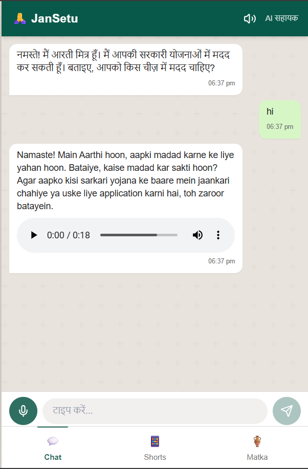

<!-- Banner -->
<div align="center">
  
  
  # 🌉 JanSetu: Bridging the Gap Between Citizens and Government

  **A Voice-First AI Companion Empowering Rural India with Accessible Government Schemes & Financial Education**
  
  <p align="center">
    
    
    
    
    
    
  </p>
</div>

---

## 📖 Project Overview

**JanSetu** (Jan = People, Setu = Bridge) is an empathetic, voice-native AI agent built to help daily wage workers and rural Indians navigate complex government bureaucracy. Millions of Indians are eligible for government support but miss out simply because they cannot read complex English or Hindi forms. 

JanSetu acts as **Aarthi Mitra**, an AI assistant that listens to users in their own dialects, finds the right government schemes, automatically populates official PDF application forms, and provides lifelong financial mentorship.

---

## 🛑 Problem Statement & Motivation

I have personally seen daily wage laborers begging and crying for money to pay medical bills, completely unaware that a government scheme could have covered them. 
The help exists, but the **access doesn't**. 

Current barriers include:
- **Language & Literacy:** Forms are in complex English or formal Hindi.
- **Digital Divide:** Lack of high-speed internet and digital literacy.
- **Bureaucratic Complexity:** Users don't know *which* scheme they qualify for.

**JanSetu solves this** by providing a WhatsApp-like voice interface that does the heavy lifting—from listening to their problems to handing them a fully-filled PDF ready for physical submission.

---

## ✨ Key Features

| Feature | Description |
|---------|-------------|
| 🗣️ **Local Voice AI** | Understands rural dialects (Bhojpuri, Maithili, Marathi) and accents. It listens the way people actually speak, not just "textbook" Hindi. |
| 📝 **"Voice-to-PDF" Action Engine** | The core innovation. Doesn't just chat; it takes spoken details and automatically populates official government PDF application forms using coordinate-mapping. |
| ✅ **Smart Eligibility Check** | Stops rejections before they happen. Verifies age, income, and land status against scheme criteria dynamically. |
| 💰 **Financial Mentorship (Matka System)** | Provides interactive financial education and money management tracking to guide users toward independence using the traditional 4-pot budgeting system. |
| 📶 **Low-Bandwidth "Lite" Mode** | Designed for 2G/3G networks, ensuring it works seamlessly in remote villages where connectivity is spotty. |
| 🛡️ **Privacy Guardrails** | Strong hallucination guardrails to prevent inventing schemes. Never stores sensitive audio post-processing. |

---

## 💻 Tech Stack

### Frontend (Client Application)
- **Framework:** React.js + Vite + TypeScript
- **Styling:** Tailwind CSS & shadcn/ui
- **State Management:** React Hooks, TanStack Query

### Backend (Core Engine)
- **Framework:** FastAPI (Python) & Uvicorn
- **PDF Generation:** PyPDF2 & ReportLab (Coordinate-based overlay)
- **Voice Synthesis:** gTTS (Google TTS) / Bhashini API Integration

### AI / ML Models
- **LLM Engine:** Amazon Bedrock (Amazon Nova Pro v1 / Claude 3.5 Sonnet)
- **Voice Processing:** Bhashini API (ASR & translation for Indian Dialects)

---

## 🧠 Model & AI Explanation

*(Note: While some boilerplate architectures might mention generic models like YOLOv8 or sensor fusion, JanSetu is purpose-built for conversational AI and document generation using advanced NLP and Voice Processing)*

1. **Speech-to-Text (ASR):** Uses **Bhashini API** to convert rural Indian dialects and accents into text reliably.
2. **AI Reasoning (Amazon Bedrock):** Powers the core conversational engine. We use a combination of strict system prompts and few-shot learning to ensure the AI behaves empathetically and strictly extracts structured data (JSON).
3. **Retrieval-Augmented Generation (RAG):** The AI queries a local `schemes_db.json` database dynamically to match user symptoms/problems with the exact government scheme requirements.
4. **Guardrail System:** A validation layer prevents AI hallucinations, ensuring the bot never invents non-existent schemes or false eligibility criteria.

---

## 🏗️ Architecture & Workflow

<details>
<summary><b>Click to view the Application Workflow</b></summary>

1. **Speak:** User taps the microphone and speaks their problem in their local dialect.
2. **Process:** Bhashini translates and transcribes the audio.
3. **Reason:** Amazon Bedrock analyzes the intent, checks eligibility against the Scheme DB, and requests missing details one-by-one.
4. **Action:** Once all data is collected, the "Voice-to-PDF" engine triggers.
5. **Done:** The system generates a filled PDF and replies with a voice note instructing the user which original documents to carry to the Seva Kendra.

</details>

### Architecture Diagram
*(Please upload your architecture diagram image to the assets folder)*


---

## 📸 Screenshots

*(Create an `assets` folder in the root and add the following screenshots)*

| Home Dashboard | Voice Interaction (Saathi) |
|:---:|:---:|
|  <br> *Suggest: Capture the main landing page with the microphone prominently displayed* |  <br> *Suggest: Capture the multi-turn conversational interface* |

| Auto-Generated PDF | Financial Matka Planner |
|:---:|:---:|
|  <br> *Suggest: Show a side-by-side of a blank form vs. the generated filled PDF* |  <br> *Suggest: Capture the traditional Matka budgeting UI* |

---

## 📂 Folder Structure

```text
JanSetu-AWS/
│
├── backend/                  # Python FastAPI Server
│   ├── audio/                # Generated MP3 voice responses
│   ├── generated_pdfs/       # Output folder for user forms
│   ├── pdf_templates/        # Blank official government forms
│   ├── main.py               # Core API, Bedrock integration & PDF Logic
│   ├── schemes_db.json       # Knowledge base of government schemes
│   └── requirements.txt      # Python dependencies
│
├── jansetu-connect/          # React.js Frontend
│   ├── src/                  # React components, pages, and hooks
│   ├── public/               # Static assets
│   ├── package.json          # Node dependencies
│   └── tailwind.config.ts    # Styling configuration
│
├── design.md                 # Detailed Architecture Document
└── requirements.md           # System Requirements Document
```

---

## 🚀 Installation & Setup

### Prerequisites
- Node.js (v18+)
- Python (3.10+)
- AWS Account with Bedrock Access
- Git

### 1. Clone the Repository
```bash
git clone https://github.com/yourusername/JanSetu-AWS.git
cd JanSetu-AWS
```

### 2. Backend Setup
```bash
cd backend

# Create virtual environment (optional but recommended)
python -m venv venv
source venv/bin/activate  # On Windows: venv\Scripts\activate

# Install dependencies
pip install -r requirements.txt

# Create .env file (use the provided .env.example or create a new one)
```

### 3. Frontend Setup
```bash
cd ../jansetu-connect

# Install dependencies
npm install
```

---

## ⚙️ Configuration (.env)

Create a `.env` file in the `backend` directory with the following variables:

```env
# AWS Credentials for Amazon Bedrock
AWS_ACCESS_KEY_ID=your_aws_access_key
AWS_SECRET_ACCESS_KEY=your_aws_secret_key
AWS_DEFAULT_REGION=us-east-1

# Bhashini API (For local dialect ASR/TTS)
BHASHINI_API_KEY=your_bhashini_key

# Application Settings
ENVIRONMENT=development
PORT=8000
```

---

## 🏃 Build and Run Instructions

### Start the Backend Server
```bash
cd backend
uvicorn main:app --reload --port 8000
```
*The API will be available at `http://localhost:8000`. You can view the API documentation at `http://localhost:8000/docs`.*

### Start the Frontend Application
```bash
cd jansetu-connect
npm run dev
```
*The application will be available at `http://localhost:5173`.*

---

## 🌍 Accessibility Impact & Real-World Use Case

JanSetu directly targets **UN Sustainable Development Goals** (No Poverty, Quality Education, Reduced Inequalities). By completely bypassing the need for digital literacy and typing, it empowers the most marginalized sections of society to claim what is rightfully theirs. 

**Real-World Scenario:** 
A farmer in a remote village whose crops were destroyed by rain simply speaks into the app: *"Meri fasal baarish me kharab ho gayi"*. JanSetu detects the issue, queries the **Pradhan Mantri Fasal Bima Yojana**, asks for his land details via voice, and instantly generates the insurance claim PDF ready for the CSC center.

---

## 🛣️ Future Improvements / Roadmap

- [ ] **WhatsApp Bot Integration:** Moving beyond the PWA to a native WhatsApp integration using Twilio/Meta API.
- [ ] **Expanded Dialect Support:** Integrating comprehensive datasets for 22+ regional Indian languages.
- [ ] **OCR Document Scanning:** Allow users to take photos of their Aadhar/Pan card to auto-extract details instead of speaking them.
- [ ] **Direct Government API Integration:** Push data directly to JanSamarth portals instead of generating PDFs.

---

## 🤝 Contribution Guidelines

We welcome contributions! To contribute:
1. Fork the repository.
2. Create a new branch (`git checkout -b feature/AmazingFeature`).
3. Commit your changes (`git commit -m 'Add some AmazingFeature'`).
4. Push to the branch (`git push origin feature/AmazingFeature`).
5. Open a Pull Request.

Please ensure your code adheres to our formatting standards and includes appropriate tests.

---

## 📄 License

Distributed under the MIT License. See `LICENSE` for more information.

---

## ✍️ Author

**Your Name / Team Name**
- GitHub: [@yourusername](https://github.com/yourusername)
- LinkedIn: [Your Profile](https://linkedin.com/in/yourprofile)

<p align="center">
  <i>If you found this project inspiring or helpful, please leave a ⭐ on the repository!</i>
</p>
