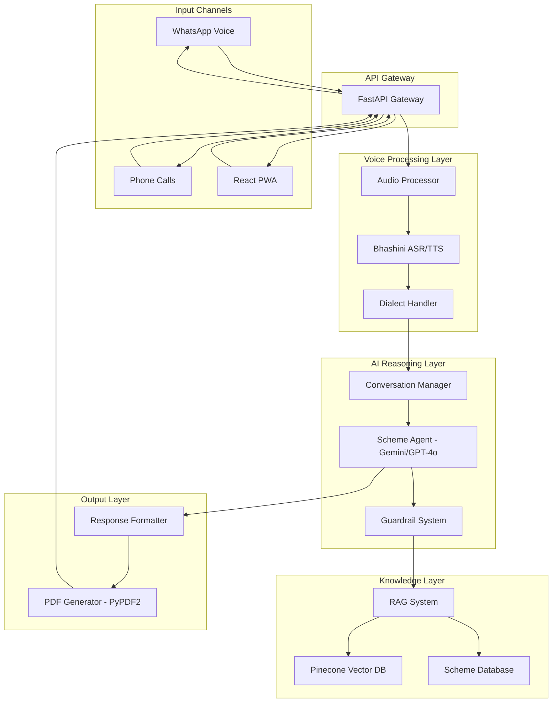

# Design Document: JanSetu

## Overview

JanSetu is a voice-first AI agent system that bridges the gap between daily wage workers/rural Indians and government bureaucracy. The system processes voice input in local dialects, identifies appropriate government schemes, guides users through application processes, and generates pre-filled PDF forms for offline submission.

The architecture follows a microservices approach with clear separation between voice processing, AI reasoning, knowledge retrieval, and form generation components. The system prioritizes accuracy through guardrails and supports multiple communication channels for maximum accessibility.

## Architecture

### High-Level Architecture



### Data Flow Diagram

**Audio Input → Bhashini → LLM Agent → PDF Filler Flow:**

1. **Audio Input Stage:**
   - User sends voice message via WhatsApp or phone call
   - Audio Processor receives and validates audio quality
   - Audio is queued for processing with session context

2. **Bhashini Processing Stage:**
   - Audio sent to Bhashini ASR API for speech-to-text conversion
   - Dialect Handler detects language and validates accuracy
   - Text output is normalized and prepared for AI processing

3. **LLM Agent Stage:**
   - Conversation Manager maintains session state and context
   - Scheme Agent (Gemini/GPT-4o) processes user intent
   - RAG System retrieves relevant scheme information from Pinecone
   - Guardrail System validates AI responses against knowledge base
   - Agent generates appropriate questions or final response

4. **PDF Filler Stage:**
   - Form Generator identifies required PDF template
   - User data is mapped to form fields
   - PyPDF2 creates pre-filled PDF with user information
   - PDF is delivered via WhatsApp or download link

## Components and Interfaces

### Voice Processing Components

**Audio Processor**
- Interface: `IAudioProcessor`
- Responsibilities: Audio validation, format conversion, quality assessment
- Methods:
  - `validateAudio(audioData: bytes) -> AudioValidationResult`
  - `convertFormat(audioData: bytes, targetFormat: str) -> bytes`
  - `assessQuality(audioData: bytes) -> QualityScore`

**Bhashini Integration**
- Interface: `IBhashiniService`
- Responsibilities: ASR/TTS operations, API management
- Methods:
  - `speechToText(audioData: bytes, language: str) -> TranscriptionResult`
  - `textToSpeech(text: str, language: str) -> AudioData`
  - `detectLanguage(audioData: bytes) -> LanguageDetectionResult`

**Dialect Handler**
- Interface: `IDialectHandler`
- Responsibilities: Language detection, dialect-specific processing
- Methods:
  - `detectDialect(text: str) -> DialectInfo`
  - `normalizeText(text: str, dialect: str) -> str`
  - `formatResponse(text: str, dialect: str) -> str`

### AI Reasoning Components

**Scheme Agent**
- Interface: `ISchemeAgent`
- Responsibilities: Intent understanding, scheme identification, conversation flow
- Methods:
  - `processUserInput(text: str, context: ConversationContext) -> AgentResponse`
  - `identifySchemes(userProfile: UserProfile) -> List[SchemeMatch]`
  - `generateQuestions(missingInfo: List[str]) -> List[Question]`

**Conversation Manager**
- Interface: `IConversationManager`
- Responsibilities: Session management, context tracking, flow control
- Methods:
  - `createSession(userId: str, channel: str) -> SessionId`
  - `updateContext(sessionId: str, userInput: str, agentResponse: str) -> None`
  - `getContext(sessionId: str) -> ConversationContext`

**Guardrail System**
- Interface: `IGuardrailSystem`
- Responsibilities: Response validation, hallucination prevention
- Methods:
  - `validateResponse(response: str, context: ConversationContext) -> ValidationResult`
  - `checkFactualAccuracy(claims: List[str]) -> AccuracyReport`
  - `flagUnsafeContent(content: str) -> SafetyFlags`

### Knowledge Components

**RAG System**
- Interface: `IRAGSystem`
- Responsibilities: Information retrieval, context augmentation
- Methods:
  - `retrieveSchemeInfo(query: str, topK: int) -> List[SchemeDocument]`
  - `augmentContext(userQuery: str, retrievedDocs: List[Document]) -> str`
  - `updateKnowledgeBase(documents: List[Document]) -> None`

**Pinecone Integration**
- Interface: `IPineconeService`
- Responsibilities: Vector storage, similarity search
- Methods:
  - `storeEmbeddings(documents: List[Document]) -> None`
  - `similaritySearch(queryVector: List[float], topK: int) -> List[Match]`
  - `updateIndex(documentId: str, embedding: List[float]) -> None`

### Output Components

**PDF Generator**
- Interface: `IPDFGenerator`
- Responsibilities: Form template management, PDF creation
- Methods:
  - `generateForm(schemeType: str, userData: UserData) -> PDFDocument`
  - `fillTemplate(templatePath: str, fieldData: Dict) -> PDFDocument`
  - `addInstructions(pdf: PDFDocument, instructions: str, language: str) -> PDFDocument`

**Response Formatter**
- Interface: `IResponseFormatter`
- Responsibilities: Multi-channel response formatting
- Methods:
  - `formatForWhatsApp(content: str, attachments: List) -> WhatsAppMessage`
  - `formatForVoice(text: str, language: str) -> VoiceResponse`
  - `formatForPWA(data: Dict) -> JSONResponse`

## Data Models

### Core Entities

**User Profile**
```python
@dataclass
class UserProfile:
    user_id: str
    phone_number: str
    preferred_language: str
    location: Optional[Location]
    occupation: Optional[str]
    income_category: Optional[str]
    family_size: Optional[int]
    documents: List[DocumentInfo]
    created_at: datetime
    updated_at: datetime
```

**Conversation Context**
```python
@dataclass
class ConversationContext:
    session_id: str
    user_id: str
    channel: str  # whatsapp, phone, pwa
    current_state: ConversationState
    collected_info: Dict[str, Any]
    identified_schemes: List[SchemeMatch]
    conversation_history: List[Message]
    language: str
    created_at: datetime
    last_activity: datetime
```

**Scheme Information**
```python
@dataclass
class SchemeInfo:
    scheme_id: str
    name: str
    description: str
    eligibility_criteria: List[EligibilityCriterion]
    required_documents: List[str]
    benefits: List[str]
    application_process: List[str]
    form_template_path: str
    ministry: str
    last_updated: datetime
```

**Audio Processing Models**
```python
@dataclass
class AudioData:
    data: bytes
    format: str  # wav, mp3, ogg
    duration: float
    sample_rate: int
    quality_score: float

@dataclass
class TranscriptionResult:
    text: str
    confidence: float
    language: str
    processing_time: float
    error: Optional[str]
```

**Form Generation Models**
```python
@dataclass
class FormField:
    field_name: str
    field_type: str  # text, number, date, checkbox
    value: Optional[str]
    is_required: bool
    validation_rules: List[str]

@dataclass
class PDFDocument:
    content: bytes
    filename: str
    form_fields: List[FormField]
    instructions: str
    language: str
    created_at: datetime
```

### API Models

**Request/Response Models**
```python
@dataclass
class VoiceInputRequest:
    audio_data: bytes
    user_id: str
    channel: str
    session_id: Optional[str]

@dataclass
class AgentResponse:
    text: str
    audio_data: Optional[bytes]
    requires_input: bool
    suggested_actions: List[str]
    pdf_document: Optional[PDFDocument]
    session_id: str
```

## Correctness Properties

*A property is a characteristic or behavior that should hold true across all valid executions of a system—essentially, a formal statement about what the system should do. Properties serve as the bridge between human-readable specifications and machine-verifiable correctness guarantees.*

### Voice Processing Properties

**Property 1: Audio Input Processing**
*For any* valid audio input from phone or WhatsApp, the Voice_Processor should successfully accept and record the audio data
**Validates: Requirements 1.1, 1.2**

**Property 2: Speech-to-Text Conversion**
*For any* audio input received, the Voice_Processor should convert it to text using Bhashini API and pass the result to the Scheme_Agent
**Validates: Requirements 1.3, 1.4**

**Property 3: Text-to-Speech Response**
*For any* text response generated by the system, the Voice_Processor should convert it to speech using Bhashini TTS
**Validates: Requirements 1.5**

**Property 4: Audio Quality Handling**
*For any* audio input with poor quality (below threshold), the Voice_Processor should request the user to repeat their message
**Validates: Requirements 1.6**

### Dialect Processing Properties

**Property 5: Language Detection**
*For any* supported Indian dialect audio input, the Dialect_Handler should automatically detect the language with reasonable accuracy
**Validates: Requirements 2.1**

**Property 6: Language Confirmation**
*For any* audio input where language detection confidence is below threshold, the Dialect_Handler should ask the user to confirm their preferred language
**Validates: Requirements 2.2**

**Property 7: Dialect Consistency**
*For any* user input in a specific dialect, all system responses should be generated in the same dialect
**Validates: Requirements 2.5**

**Property 8: Unsupported Language Fallback**
*For any* unsupported dialect input, the Dialect_Handler should inform the user and offer Hindi as an alternative
**Validates: Requirements 2.6**

### Scheme Processing Properties

**Property 9: Scheme Identification**
*For any* user situation description, the Scheme_Agent should analyze needs against available government schemes and identify relevant matches
**Validates: Requirements 3.1**

**Property 10: Scheme Ranking**
*For any* user profile with multiple applicable schemes, the Scheme_Agent should present options ranked by relevance and eligibility
**Validates: Requirements 3.2**

**Property 11: Information Gathering**
*For any* incomplete user profile, the Scheme_Agent should ask specific clarifying questions to determine eligibility requirements
**Validates: Requirements 3.3**

**Property 12: Alternative Suggestions**
*For any* user ineligible for requested schemes, the Scheme_Agent should suggest alternative schemes or next steps
**Validates: Requirements 3.5**

### Guardrail Properties

**Property 13: Response Validation**
*For any* response generated by the Scheme_Agent, the Guardrail_System should verify information against the RAG_System knowledge base
**Validates: Requirements 4.1**

**Property 14: Uncertainty Communication**
*For any* query where scheme details are uncertain, the Guardrail_System should explicitly state uncertainty and recommend official verification
**Validates: Requirements 4.2**

**Property 15: Hallucination Prevention**
*For any* system response, the Guardrail_System should prevent invention of non-existent schemes or requirements
**Validates: Requirements 4.3**

**Property 16: Unknown Information Handling**
*For any* query about information not in the knowledge base, the Guardrail_System should direct users to official government sources
**Validates: Requirements 4.4**

**Property 17: Safety Filtering**
*For any* potentially harmful or misleading content, the Guardrail_System should flag and block the response
**Validates: Requirements 4.5**

### PDF Generation Properties

**Property 18: Form Generation**
*For any* complete user information set, the Form_Generator should create a pre-filled PDF application form for the identified scheme
**Validates: Requirements 5.1**

**Property 19: Field Population**
*For any* PDF generation request, all required fields should be populated with user-provided information
**Validates: Requirements 5.3**

**Property 20: Empty Field Marking**
*For any* optional fields that are empty, the Form_Generator should clearly mark them for manual completion
**Validates: Requirements 5.4**

**Property 21: Instruction Generation**
*For any* generated PDF, instructions should be included in the user's detected dialect
**Validates: Requirements 5.5**

**Property 22: PDF Delivery**
*For any* completed PDF generation, the form should be delivered via WhatsApp or download instructions should be provided
**Validates: Requirements 5.6**

### Conversation Management Properties

**Property 23: Conversation Initiation**
*For any* new conversation, the Scheme_Agent should greet the user and ask about their needs in their detected dialect
**Validates: Requirements 6.1**

**Property 24: Question Pacing**
*For any* information collection phase, the Scheme_Agent should ask only one question at a time
**Validates: Requirements 6.2**

**Property 25: Follow-up Questions**
*For any* incomplete user response, the Scheme_Agent should ask specific follow-up questions
**Validates: Requirements 6.3**

**Property 26: Application Summary**
*For any* complete information collection, the Scheme_Agent should summarize the application before PDF generation
**Validates: Requirements 6.4**

**Property 27: Context Preservation**
*For any* conversation interaction, the Scheme_Agent should maintain context throughout the entire session
**Validates: Requirements 6.5**

**Property 28: Response Modification**
*For any* user request to change previous responses, the Scheme_Agent should allow modification of earlier answers
**Validates: Requirements 6.6**

### Multi-Channel Properties

**Property 29: Cross-Channel Session Management**
*For any* user switching between communication channels, the system should maintain session and conversation state
**Validates: Requirements 7.4**

**Property 30: Channel Failure Handling**
*For any* unavailable communication channel, the system should inform users about alternative access methods
**Validates: Requirements 7.5**

**Property 31: Functional Consistency**
*For any* supported communication channel, the system should provide consistent core functionality
**Validates: Requirements 7.6**

### Security and Privacy Properties

**Property 32: Data Encryption**
*For any* personal information collected, the system should encrypt data both in transit and at rest
**Validates: Requirements 8.1**

**Property 33: Audio Data Retention**
*For any* audio recording processed, the system should not store the recording after processing is complete
**Validates: Requirements 8.2**

**Property 34: Data Minimization**
*For any* PDF generation, only necessary information for the specific scheme application should be included
**Validates: Requirements 8.3**

**Property 35: Data Deletion**
*For any* user request for data deletion, the system should remove all stored personal information
**Validates: Requirements 8.5**

## Error Handling

### Audio Processing Errors

**Poor Audio Quality:**
- Detect audio quality below acceptable threshold (SNR < 10dB)
- Request user to repeat message with clearer audio
- Provide tips for better audio quality (quiet environment, closer to microphone)
- Fallback to text input via PWA if audio continues to fail

**Bhashini API Failures:**
- Implement retry logic with exponential backoff (3 attempts)
- Cache successful API responses to reduce dependency
- Fallback to alternative ASR/TTS services if available
- Graceful degradation to text-only mode

**Language Detection Failures:**
- Set confidence threshold for language detection (>80%)
- Ask user to confirm language when confidence is low
- Default to Hindi if no clear language detected after confirmation
- Log detection failures for model improvement

### AI Processing Errors

**LLM API Failures:**
- Implement circuit breaker pattern for API calls
- Retry with different model endpoints (Gemini → GPT-4o)
- Use cached responses for common queries
- Provide fallback responses directing to government helplines

**Guardrail Violations:**
- Block responses that fail fact-checking against knowledge base
- Log all blocked responses for system improvement
- Provide generic safe responses when guardrails trigger
- Escalate to human review for repeated violations

**Context Loss:**
- Persist conversation state to database after each interaction
- Implement session recovery from stored state
- Ask user to confirm previous information if context is unclear
- Restart conversation flow if context cannot be recovered

### Knowledge Base Errors

**RAG System Failures:**
- Implement fallback to cached scheme information
- Use multiple vector search strategies (semantic + keyword)
- Gracefully handle empty search results
- Direct users to official government websites when information is unavailable

**Outdated Information:**
- Implement timestamp-based information freshness checks
- Flag responses using information older than 30 days
- Provide disclaimers about information currency
- Regular automated updates from official government sources

### PDF Generation Errors

**Template Errors:**
- Validate PDF templates before use
- Maintain backup templates for critical schemes
- Generate plain text forms if PDF generation fails
- Provide manual form filling instructions

**Field Mapping Errors:**
- Validate user data against form field requirements
- Highlight missing required information clearly
- Provide data format examples (date formats, ID numbers)
- Allow partial form generation with clear missing field indicators

### Channel-Specific Errors

**WhatsApp API Failures:**
- Implement message queuing for failed deliveries
- Retry message sending with exponential backoff
- Fallback to SMS for critical notifications
- Provide alternative contact methods

**Phone System Failures:**
- Implement call routing to backup numbers
- Provide busy signal handling with callback options
- Record failure metrics for capacity planning
- Maintain uptime monitoring and alerting

## Testing Strategy

### Dual Testing Approach

The testing strategy employs both unit testing and property-based testing to ensure comprehensive coverage:

**Unit Tests:**
- Verify specific examples and edge cases
- Test integration points between components
- Validate error conditions and boundary cases
- Focus on concrete scenarios and known inputs

**Property-Based Tests:**
- Verify universal properties across all inputs
- Test system behavior with randomized data
- Ensure correctness properties hold for large input spaces
- Catch edge cases that unit tests might miss

Both testing approaches are complementary and necessary for comprehensive system validation.

### Property-Based Testing Configuration

**Framework Selection:**
- Python: Use Hypothesis for property-based testing
- Minimum 100 iterations per property test
- Custom generators for domain-specific data (audio files, user profiles, scheme data)

**Test Tagging:**
Each property-based test must include a comment referencing the design document property:
```python
# Feature: naya-saathi, Property 1: Audio Input Processing
def test_audio_input_processing_property():
    # Test implementation
```

**Property Test Implementation:**
- Each correctness property maps to exactly one property-based test
- Tests should generate realistic data within valid input domains
- Focus on core business logic without excessive mocking
- Validate end-to-end behavior where possible

### Unit Testing Strategy

**Component Testing:**
- Test each interface implementation independently
- Mock external dependencies (Bhashini API, Pinecone, LLM APIs)
- Validate error handling and edge cases
- Test configuration and initialization logic

**Integration Testing:**
- Test component interactions without mocking
- Validate data flow between components
- Test channel-specific integrations (WhatsApp, phone)
- Verify PDF generation with real templates

**Performance Testing:**
- Load testing for concurrent users (target: 100 concurrent conversations)
- Audio processing latency testing (target: <3 seconds end-to-end)
- Memory usage testing for long conversations
- API rate limit and throttling validation

### Test Data Management

**Synthetic Data Generation:**
- Generate realistic user profiles for different demographics
- Create audio samples in multiple Indian dialects
- Generate government scheme data for testing
- Create PDF templates for major schemes

**Test Environment:**
- Isolated test environment with mock external APIs
- Staging environment with real API integrations
- Production-like data volumes for performance testing
- Automated test data cleanup and refresh

### Continuous Testing

**Automated Testing Pipeline:**
- Run unit tests on every code commit
- Execute property-based tests on pull requests
- Performance testing on staging deployments
- Integration testing with external APIs daily

**Monitoring and Alerting:**
- Track test execution times and failure rates
- Monitor property test failure patterns
- Alert on regression in core functionality
- Dashboard for test coverage and quality metrics